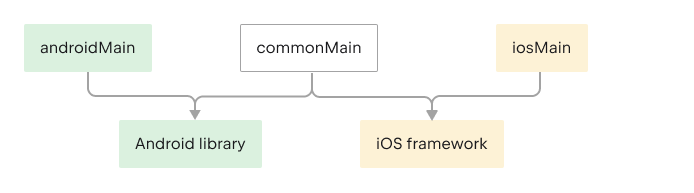
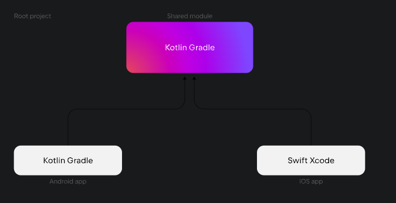

[こちら](https://www.jetbrains.com/help/kotlin-multiplatform-dev/multiplatform-getting-started.html)のサンプルを触ってみる

## セットアップ
どうやらWindowsはだめらしい
::warning
To write iOS-specific code and run an iOS application on a simulated or real device, you'll need a Mac with macOS. This cannot be performed on other operating systems, such as Microsoft Windows. This is an Apple requirement.
::

必要なツール
* Android Studio
* Xcode
* JDK
* Kotlin Multiplatform plugin
* Kotlin plugin

``java -version``
```
openjdk version "17.0.6" 2023-01-17
OpenJDK Runtime Environment Temurin-17.0.6+10 (build 17.0.6+10)
OpenJDK 64-Bit Server VM Temurin-17.0.6+10 (build 17.0.6+10, mixed mode)
```

診断ツールとして`KDoctor`というのがある
``brew install kdoctor``
使い方
``kdoctor``
実行すると次の結果に。一応KMPは使えるらしい。

```
[✓] Operation System
[✓] Java
[!] Android Studio
  ! Android Studio (AI-223.8836.35.2231.11005911)
    Location: /Applications/Android Studio.app
    Bundled Java: openjdk 17.0.6 2023-01-17
    Kotlin Plugin: 223-1.9.0-release-358-AS8836.35.2231.11005911
    Kotlin Multiplatform Mobile Plugin: not installed
    Install Kotlin Multiplatform Mobile plugin - https://plugins.jetbrains.com/plugin/14936-kotlin-multiplatform-mobile
[✓] Xcode
[!] CocoaPods
  ! CocoaPods configuration is not required, but highly recommended for full-fledged development
  ✖ CocoaPods requires your terminal to be using UTF-8 encoding.
    Consider adding the following to ~/.zprofile
    export LC_ALL=en_US.UTF-8

Conclusion:
  ✓ Your operation system is ready for Kotlin Multiplatform Mobile Development!
```

* Android Studioを最新のものにいれた
* Kotlin Multiplatform pluginもいれた（https://plugins.jetbrains.com/plugin/14936-kotlin-multiplatform）
* zprofileを更新
→オールグリーンになった

## プロジェクトを作成する
1. [Kotlin Multiplatform wizard](https://www.jetbrains.com/help/kotlin-multiplatform-dev/multiplatform-create-first-app.html#create-the-project-with-a-wizard:~:text=Open%20the-,Kotlin%20Multiplatform%20wizard,-.)からプロジェクトを作成する
* モバイルアプリケーションを作成する場合、すでにAndroid/iOSにチェックがついてるので、そのまままでおｋ
* Compose Multiplatform UI frameworkがベータになっているので、こちらにチェックいれたA
2. Android Studio立ち上げ
   1. さきほどのProjectファイルをOpen（zip解凍する必要あり）
   2. デフォルトの外観がAndroid開発に最適化されてるのをKMPに対応してProjectに変えたほうがいいとなったが、それに対応するところを見つけられず・・・
KMPプロジェクトはつの3つのモジュールが含まれる
* shared
  * 共通ロジック
  * 次の３つで構成される
    * androidMain
    * commonMain
    * iosMain
  * KMPでは異なるソースsetモジュールは異なるプラットフォームをtargetとすることができる
  * 
* composeApp
  * AndroidアプリへビルドするKotlinモジュール
* iosApp
  * iOSアプリをビルドするXcodeプロジェクト
  * 共有されるモジュールは通常のフレームワークもしくはCocoapodsが使われる


3. こんな感じで既存のファイルを更新する

```kotlin: Greeting.kt
import java.util.Random

fun greet(): String {
    val firstWord = if (Random().nextBoolean()) "Hi!" else "Hello!"

    return firstWord
}
```

ここでRandomクラスがエラーとなっていて、javaの関数をKotlinコードから呼ぼうとしているため、

IDEのsuggestionにしたがって`kotlin.random.Random`にimport元を変える
いろいろ変わって次のようなコードになる

```kotlin: Greeting.kt
import kotlin.random.Random

class Greeting {
    private val platform: Platform = getPlatform()

    fun greet(): String {
        val firstWord = if (Random.nextBoolean()) "Hi!" else "Hello!"

        return "$firstWord Guess what this is! > ${platform.name.reversed()}!"
    }
}
```

::warning
共通のKotlinのみでコードを記述すると、特定のぷらっとフィームを使用できないため、明らかな制限があります。インターフェースとexpect/actualメカニズムを使用すると、これを解決できます。
::

### Platform固有の実装
1. プロジェクト作成した際にPlatform.ktファイルがcommonMainモジュールに入っている。

```kotlin
interface Platform {
    val name: String
}
```

2. androidMainモジュールとiosMainモジュールを切り替える。AndroidとiOSのソースセットに対して、同じ機能の異なる実装があることがわかる。

```kotlin
// Platform.android.kt in the androidMain module:
class AndroidPlatform: Platform {
    override val name: String =
        "Android ${android.os.Build.VERSION.SDK_INT}"
}
// Platform.ios.kt in the iosMain module:
import platform.UIKit.UIDevice

class IOSPlatform: Platform {
    override val name: String =
        UIDevice.currentDevice.systemName() + " " + UIDevice.currentDevice.systemVersion
}
```

3. `getPlatform()`関数

```kotlin
// Platform.kt in the commonMain module:
expect fun getPlatform(): Platform
// Platform.android.kt in the androidMain module:
actual fun getPlatform(): Platform = AndroidPlatform()
// Platform.ios.kt in the iosMain module:
actual fun getPlatform(): Platform = IOSPlatform()
```

## アプリを動かす
それではアプリを起動します。

### Android
configurationで`composeApp`を選択した状態でエミュレーターを選び、Runボタンを押します。またはF5？

### iOS
1. Xcodeを起動します。
2. configurationでiosAppを選択し、Run
ここでiOS18のβ版をいれてるからなのか、Execution Targetに出てくる機種でビルドができない。iOS17.0もリストに出てこない・・てことで、Xcodeからプロジェクトファイルを直接RUNするとiPhoneでもビルドできた。。

## Update UI

## Add dependencies to your project
次にクロスプラットフォームアプリケーションを適切に構築するために必要な、サードパーティライブラリに依存関係を追加する方法を学ぶ

### Dependency types
KMPにおいて、２つの依存タイプがある
* Multiplatform dependencies
これらは複数のターゲットをサポートするマルチプラットフォームライブラリであり、共通のソースセット`commonMain`で使用できる
多くのAndroidライブラリはすでにマルチプラットフォームをサポートしている

* Native dependencies
関連するエコシステムからの通常のライブラリです。Androidの場合は、Gradleを使用し、iOSの場合はCocoaPodsまたは別の依存関係マネージャを使用して作業する

共通モジュールを使用する場合、セキュリティストレージなどのプラットフォームAPIを使用する場合は、通常ネイティブの依存関係が必要になる。ネイティブの依存関係が必要になる。

### Add a multiplatform dependency
::
AndroidプロジェクトにGradle依存関係を追加するのと似ている。唯一の違いは、ソースセットを指定する必要がある。
::

デバイス情報に加えて、元旦までの残り日数を表示する関数を追加します。 マルチプラットフォームに完全対応しているkotlinx-datetimeライブラリは、共有コードで日付を扱う最も便利な方法です。

1. `build.gradle.kts`ファイルを開く
2. `commonMain`ソースセットに次の依存関係を追加する

## Share more logic between iOS and Android

#### kotlinx.coroutines
非同期処理において、同期的な処理を可能とする
`build.gradle.kts`に次のコードを記述する

```kotlin
           kotlin {
    // ...
    sourceSets {
        commonMain.dependencies {
           // ...
           implementation("org.jetbrains.nx:kotlinx-coroutines-core:1.7.3")
           
        }
    }
    
```

マルチプラットフォームGradleプラグインは自動的にプラットフォームごとのkotlinx.coroutinesの依存関係を追加してくれる

#### kotlinx.serialization
通信処理で使われるエンティティーオブジェクトへのJSONデコード処理に用いる
`build.gradle.kts`の最初のほうに次のコードをいれる

```kotlin: build.gradle.kts
plugins {
    // ...
    kotlin("plugin.serialization") version "2.0.0"
}
```

#### Ktor
HTTPクライアントフレームワーク
共通ソースに含める。また、サポートの依存関係も含める必要がある。

``
Add the ContentNegotiation functionality (ktor-client-content-negotiation), which allows serializing and deserializing the content in a specific format.

Add the ktor-serialization-kotlinx-json dependency to instruct Ktor to use the JSON format and kotlinx.serialization as a serialization library. Ktor will expect JSON data and deserialize it into a data class when receiving responses.
``
先程のコードを次のように書き換える

```kotlin: build.gradle.kts
kotlin {
    // ...
    val ktorVersion = "2.3.7"

    sourceSets {
        commonMain.dependencies {
            // ...

            implementation("io.ktor:ktor-client-core:$ktorVersion")
            implementation("io.ktor:ktor-client-content-negotiation:$ktorVersion")
            implementation("io.ktor:ktor-serialization-kotlinx-json:$ktorVersion")
        }
        androidMain.dependencies {
            implementation("io.ktor:ktor-client-android:$ktorVersion")
        }
        iosMain.dependencies {
            implementation("io.ktor:ktor-client-darwin:$ktorVersion")
        }
    }
}
```

### Create API requests

#### Add a data model
エンティティークラスを作成する

```kotlin
import kotlinx.serialization.SerialName
import kotlinx.serialization.Serializable

@Serializable
data class RocketLaunch (
    @SerialName("flight_number")
    val flightNumber: Int,
    @SerialName("name")
    val missionName: String,
    @SerialName("date_utc")
    val launchDateUTC: String,
    @SerialName("success")
    val launchSuccess: Boolean?,
)
```

`@Serializable`はkotlinx.sealizationプラグインで自動的にシリアライザーとなる
`@SerialName`はフィールド名を再定義し、データクラスのフィールド名の可読させ、プロパティ定義を可能とする

#### Connect HTTP Client

